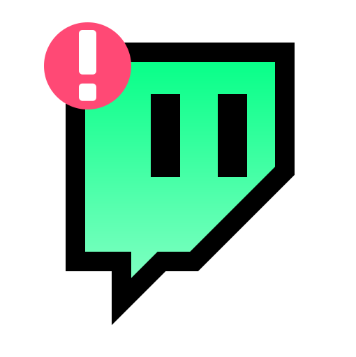

[![Issues][issues-shield]][issues-url]
[![MIT License][license-shield]][license-url]
![downloads-shield]
[![Latest Version][latest-version-shield]][latest-version-url]

  
 
  <h1 align="center">TWITCHTRACK</h1>
 
  

    An Electron application that helps with keeping track on your favourite Twitch streamers!
  
 
 

 
 
 

## About TwitchTrack
![Application Name Screen Shot][app-screenshot]

TwitchTrack is an application which purpose is to help keeping track on if your favourite Twitch streamers are either live or not.\
 
It does so by: 
- showing a feed of which of your choosen streamers are currently live :heavy_check_mark:
- what category they're currently under :heavy_check_mark:
- what their title is :heavy_check_mark:
- how many viewers they have :heavy_check_mark:
- how long they've been live for :heavy_check_mark:
 
TwitchTrack will also give sound notifications to make sure that you don't miss when a streamer goes live or offline.
:smile:

(<a href="#top">back to top</a>)

### Built With

#### Frameworks
- [Electron](https://www.electronjs.org/)
- [React.js](https://reactjs.org/)
- [Typescript](https://www.typescriptlang.org/)

#### Some plugins and tools that were used
- [React-Redux](https://react-redux.js.org/)
- [Vite](https://vitejs.dev)
- [electron-log](https://www.npmjs.com/package/electron-log/)
- [node-fetch](https://www.npmjs.com/package/node-fetch/)

(<a href="#top">back to top</a>)

## Roadmap

- [ ] Add notifications for title and category updates
- [ ] Add more customizable features

(<a href="#top">back to top</a>)

## License

Distributed under the MIT License. See `LICENSE.txt` for more information.

(<a href="#top">back to top</a>)

## Contact

:computer: Discord - Swolebob#1716
 
:envelope: Email - christopherkarlsson95@gmail.com

(<a href="#top">back to top</a>)

[issues-shield]: https://img.shields.io/github/issues/ChristopherK95/twitch-track-electron?color=orange&style=for-the-badge
[issues-url]: https://github.com/ChristopherK95/twitch-track-electron/issues
[license-shield]: https://img.shields.io/github/license/ChristopherK95/twitch-track-electron?color=%2357c1ff&style=for-the-badge
[license-url]: https://github.com/ChristopherK95/twitch-track-electron/blob/master/LICENSE.txt
[downloads-shield]: https://img.shields.io/github/downloads/ChristopherK95/twitch-track-electron/total?color=%230fffb3&style=for-the-badge
[latest-version-shield]: https://img.shields.io/github/v/release/ChristopherK95/twitch-track-electron?style=for-the-badge
[latest-version-url]: https://github.com/ChristopherK95/twitch-track-electron/releases/latest
[app-screenshot]: images/GifPreview.gif